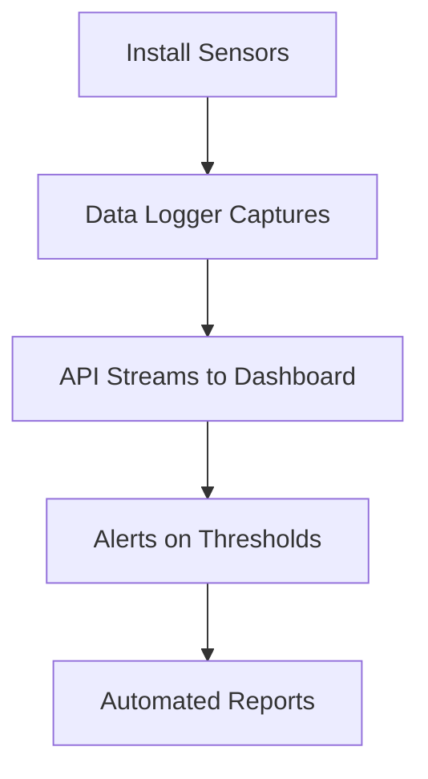

## Overview

Osprey Demo provides advanced geotechnical instrumentation solutions for civil and resources sectors. You gain access to tools like the Osprey Tilt String for distributed tilt measurements and the In-Place Extensometer for precise settlement monitoring. These products automate data capture, simplify installation, and reduce monitoring costs across infrastructure projects.

Key capabilities include versatile mounting options, high-precision sensor arrays, and robust designs for harsh environments. Use cases span diaphragm walls, pipelines, railways, and retaining structures.

<Callout kind="info">
Osprey instruments connect via a serial sensor bus, enabling up to 150 measurement points per cable for comprehensive monitoring.
</Callout>

## Key Features

Discover the core strengths of Osprey products through these highlighted features.

<Columns cols="3">
  <Card title="Distributed Tilt Measurement" icon="trending-up" href="#tilt-string">
    Measure tilts across vertical and linear assets with micro-tilt sensors spaced to your needs.
  </Card>
  <Card title="Precision Settlement Monitoring" icon="ruler" href="#extensometer">
    Track deformations with high-accuracy extensometers deployable in concrete or soil.
  </Card>
  <Card title="Automated Data Management" icon="database" href="#data-capture">
    Streamline readings with single access points and low-cost, real-time data capture.
  </Card>
</Columns>

## Osprey Tilt String (OTS)

The Osprey Tilt String excels in providing tilt data from multiple points along a cable. Its robust design supports embedding in concrete, trenching with pipelines, or surface mounting on walls and rails.

### Mounting Options

<Tabs>
  <Tab title="Diaphragm Wall" icon="wall">
    Embed directly in concrete during pour. Sensors withstand construction vibrations.
  </Tab>
  <Tab title="Trench/Pipeline" icon="pipe">
    Lay alongside pipelines for linear monitoring. IP67-rated for burial.
  </Tab>
  <Tab title="Surface/Railway" icon="train">
    Attach to retaining walls or rails. Resilient to maintenance traffic.
  </Tab>
</Tabs>

### Installation Steps

<Steps>
  <Step title="Prepare Site" icon="map">
    Select sensor spacing based on project precision needs (e.g., 0.5m intervals for high-resolution).
  </Step>
  <Step title="Deploy Cable" icon="download">
    Position the OTS cable in trench or formwork. Connect to power and data logger.
  </Step>
  <Step title="Calibrate" icon="settings">
    Use the Osprey dashboard at `https://dashboard.example.com` to zero sensors.
  </Step>
</Steps>

## In-Place Extensometer (IPX)

The IPX delivers micron-level precision for settlement and deformation tracking. Deploy it in boreholes, anchors, or embedded structures for reliable long-term data.

<Expandable title="Advanced Deployment Details" default-open="false">
IPX anchors extend up to 10m with customizable rod lengths. Pair with OTS for hybrid monitoring.
</Expandable>

## Data Capture and Automation

Access data via API for seamless integration. Automate readings to eliminate manual surveys.

<CodeGroup tabs="JavaScript,Python">
  ```javascript
  const response = await fetch('https://api.example.com/v1/tilt-data?device=OTS001', {
    headers: { 'Authorization': 'Bearer YOUR_API_KEY' }
  });
  const data = await response.json();
  console.log(data.tilts); // Array of tilt measurements
  ```
  ```python
  import requests
  response = requests.get(
      'https://api.example.com/v1/tilt-data?device=OTS001',
      headers={'Authorization': 'Bearer YOUR_API_KEY'}
  )
  data = response.json()
  print(data['tilts'])  # List of tilt values in degrees
  ```
</CodeGroup>

<ParamField path="device" param-type="string" required="true">
Device ID like `OTS001` or `IPX123`.
</ParamField>

<ParamField header="Authorization" param-type="string" required="true">
Bearer token from `https://dashboard.example.com/api-keys`.
</ParamField>

## Real-World Use Cases

Apply Osprey solutions to diverse infrastructure challenges.

<Tabs>
  <Tab title="Railway Monitoring" icon="train">
    Detect track settlements early with surface-mounted OTS. Reduce downtime from maintenance-induced shifts.
  </Tab>
  <Tab title="Dam Safety" icon="dam">
    Embed IPX in foundations for precise deformation tracking. Automate alerts for thresholds.
  </Tab>
  <Tab title="Urban Tunnels" icon="road">
    Use OTS in diaphragm walls to monitor construction convergence.
  </Tab>
</Tabs>



## Benefits Summary

<Callout kind="success">
Reduce costs by 50% through automated monitoring. Achieve `<0.1°` tilt precision across 150+ points.
</Callout>

Next, explore [Quickstart](/quickstart) for hands-on setup or [Authentication](/authentication) for secure API access.